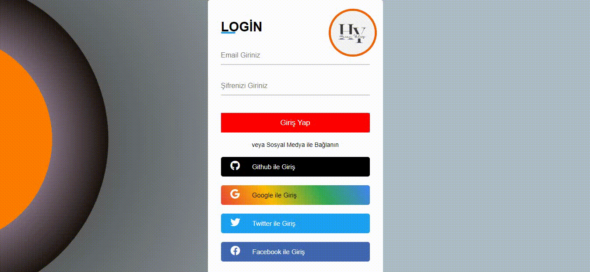

# Login-HY

Giriş Sayfası
Bu proje, CSS ve HTML kullanılarak oluşturulan bir giriş sayfasını içerir. Sayfa, kullanıcıların giriş yapmalarını sağlayan bir arayüz sunar ve aynı zamanda animasyonlu butonlar, resimler ve GIF'ler içerir. GitHub, Facebook, Google ve Twitter'dan giriş yapma seçeneklerini sunar.

Özellikler
Kullanıcı dostu bir giriş sayfası
Animasyonlu butonlar
Resim ve GIF içerikleri
GitHub, Facebook, Google ve Twitter ile giriş yapma seçenekleri

Bu depoyu klonlayın:

-git clone https://github.com/KullaniciAdiniz/Login-HY.git

-İndirilen dizine gidin:
cd Login-HY

-index.html dosyasını bir tarayıcıda açın.

-Kullanım
Sayfayı bir tarayıcıda açtığınızda, giriş yapma seçeneklerini göreceksiniz.
GitHub, Facebook, Google veya Twitter butonlarına tıklayarak ilgili hesaplarınızla giriş yapabilirsiniz.
Animasyonlu butonlar üzerinde fareyi gezdirdiğinizde değişiklikler görebilirsiniz.
Sayfada bulunan resimler ve GIF'ler sayesinde görsel bir deneyim yaşayabilirsiniz.

-Katkıda Bulunma
Kat contributionsaltmaları için adım adım bir yönergeli ekleyebilirsiniz. İşte örnek bir yönerge:

Bu projeyi kendi hesabınıza çatallayın.
Yeni bir özellik veya düzeltme için bir dal oluşturun: git checkout -b yeni-özellik
Değişikliklerinizi yapın ve bunları birleştirilebilir bir şekilde taahhüt edin: git commit -m 'Yeni özellik ekle'
Dalınızı ana dal ile birleştirin: git merge master
Dalınızı yayınlayın: git push origin yeni-özellik
Bir birleştirme isteği (pull request) gönderin.
